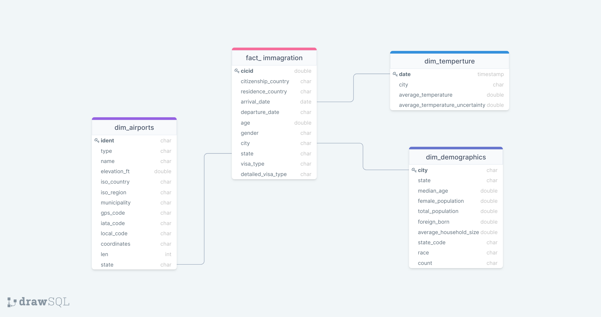

# Data Engineering Capstone Project

## Project Summary
In this project, the key objective of this project is create an ETL pipline from  I94 Immigration
is figre out how factors affect the number of tourists,some factors is :
- the temperature
- the reasonality of travel
- the number of entry ports
- the demographics of various citis.

Data can be used to analyse immigration flow to and from US through different airports. It's used a star schema with a facts table an dimensional tables.

The project follows the follow steps:
* Step 1: Scope the Project and Gather Data
* Step 2: Explore and Assess the Data
* Step 3: Define the Data Model
* Step 4: Run ETL to Model the Data
* Step 5: Complete Project Write Up
## Scope the Project and Gather Data
### Project Scope 
In this project, I will utilize the PySpark to perform an extract data , transform data and load ETL pipline.
The ETL pipeline is base on the following steps:
    Collect data from Database --> Processing data --> Cleaning data --> Storing data to the Data warehourse.
The output of ETL is Star Schema model to parquet files and it can be store in local system,AWS Redshift,Cloud Database or ..etc..
The main tools is pandas,pyspark 

### Describe and Gather Data 
The project is using the datasets:
 - Immigration Data:  A data dictionary is included in the workspace.This data comes from the U.S. National Tourism and Trade Office. More information on the immigration data [here](https://travel.trade.gov/research/reports/i94/historical/2016.html).
 - US Cities Demographic: The data of the demographic of all US cities and census-designated places with a population greater or equal to 65,000. Dataset comes from OpenSoft found [here](https://public.opendatasoft.com/explore/dataset/us-cities-demographics/export/)
 - Global Land Temperatures By City: the data of the temperatures of various cities in the world from  1743 to 2013. This dataset came from Kaggle found [here](https://www.kaggle.com/datasets/berkeleyearth/climate-change-earth-surface-temperature-data).
 - Airport Code Table: Airpot codes data contains information about different airports around the world. The data come from [here](https://datahub.io/core/airport-codes#data)

### Define the Data Model
#### Conceptual Data Model
I create a Star Schema for OLAP queries. The Schema for each table will following the bellow figure:

### 3.2 Mapping Out Data Pipelines
-  Extract the I94_SAS_Labels_Descriptions
- Extract the the I94_SAS_Labels_Description.SAS file to CSV files.
The output files:
    - i94_country.csv
    - i94_model.csv
    - i94_port.csv
    - i94_state_addrl.csv
    - i94_visa.csv
- Data loading,transformation,cleanup and create spark data table frame

    - fact_immagration
        - Load the immigration data from the base dataset.
        - Convert for arrival and departure data column.
        - Convert for i94visa and i94mode data column.
        - Remove all entries into the united states that weren't via air travel.
        - Drop rows where the gender values entered is undefined.
        - Convert the arrival dates and departure dates into new columns.
        - Filter up the arrival modes.
        - Use an inner join to drop invalid codes country of citizenship and for countr of residence.
        - Add entry_port names and entry port states.
        - Compute the age of each individual.
        - Insert the immigration fact data into a spark dataframes.
        - Saving the data in parquet format.
    - dim_airports
        - Load the csv directly into a spark dataframes.
        - Equivalent to the following pandas code.
        - Verify that the municipality field is available for all airports.
        - Convert the municipality column to upper case in order to be able to join it with our other datasets.
        - Extract the state codes.
        - Convert the dataframes from pandas to spark.
        - Saving the data in parquet format in a spark dataframe.
    - dim_demographics
        - Load the various csv files into pandas dataframes.
        - Convert the city to upper case and remove any leading and trailing spaces.
        - Remove any leading or trailing spaces and convert to upper case.
        - Primary key will be the combination of city name and race.
        - Convert the dataframes from pandas to spark.
        - Insert data into the demographics dim table.
        - Saving the data in parquet format.
    - dim_temperture
        - Load data base abd use pandas to load DataFame.
        - Keep only data for the United States.
        - Convert the date to datetime objects.
        - Remove all dates prior to 1950.
        - Convert the city names to upper case.
        - Convert the dataframes from pandas to spark
        - Insert the temperature dim data into a spark dataframe.
        - Saving the data in parquet format.

## Run Pipelines to Model the Data
Before run the ETL pipline script, please install pip libraries following the ***requirements.txt***  file
```
pip install -r requirements.txt
```
### Create the data model
Build the data pipelines to create the data model. Refer and run etl.py script to create the data pipelines.
```
from etl import *
print("Start the ETL process ......")
print("----------------------------------------------------------------")
print("Create the Spark Session...")
spark = create_Spark()
print("----------------------------------------------------------------")
print("Extraxting SAS dataset...")
get_SAS_dataset()
print("----------------------------------------------------------------")
main_etl(spark)
print("Finish the ETL process")
```

### Data Quality Checks
Explain the data quality checks you'll perform to ensure the pipeline ran as expected. These could include:
 * Integrity constraints on the relational database (e.g., unique key, data type, etc.)
 * Unit tests for the scripts to ensure they are doing the right thing
 * Source/Count checks to ensure completeness
 
Run Quality Check
```
from quality_check import *
print("Start the data quality_check process ......")
print("----------------------------------------------------------------")
print("Create the Spark Session...")
spark = create_Spark()
print("----------------------------------------------------------------")
main_check(spark)
```

## Complete Project Write Up
* The rationale for the choice of tools and technologies for the project:
    - Pandas for loading CSV data files then process,clean and analyse data
    - Spark for large datasets such as sas7bdat data. It's helpful for processing to extract,transform,load and store tables.

* Propose how often the data should be updated:
    - Because the raw data of immigration and temperature are built based on the month so that dataset should be update every month.
    - For all tables during the update, it should proceed with "append" mode.
* How often ETL script should be run:
    - The ETL script should be run monthly basis

* Suggestions for following scenarios:
    * Data is 100x:
        - The data would be stored in AWS S3 bucket or orther cloud storage.
        - Spark platform can still use to process the data but it should enable parallel processing of the data.
        - The AWS Redshift is good choose to store the data during processing of the ETL script running.
    * Data is used in dashboard and updated every day 07:00AM:
        - Use the Apache Airflow to perform the ETL and data qualtiy validation.
        - The output data should be store and updated in cloud storage susch as AWS RDS to allow the dashboard to display the data all the time.
    * The database needed to be accessed by 100+ people:
        - In this case, the data should be migrated to the AWS Redshift to allow the auto-scaling capabilities.
        - Immigration the Elastic Load Balancing of AWS to improve the performance of the dashboard application.